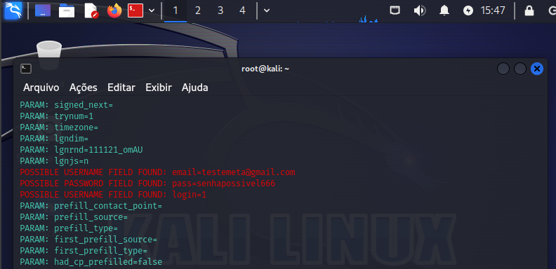

<h1>Ferramentas</h1>

<b>Kali Linux</b>

<b>setoolkit</b>

<h1>Configurando o Phishing no Kali Linux</h1>
Acesso root 
Inicie setoolkit, ele dará algumas opções de ataque. 
Tipo de ataque Social-Engineering Attacks, opção 1.  
Vetor de ataque: Web Site Attack Vectors, opção 2.  
Método de ataque: Credential Harvester Attack Method, opção 3.  
Método de ataque: Site Cloner, opção 2.  
Obtendo o endereço da máquina: ifconfig  
URL para clone: http://www.facebook.com  
Resutados:  

